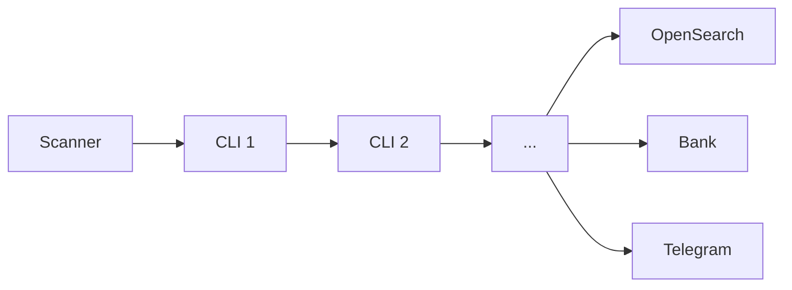
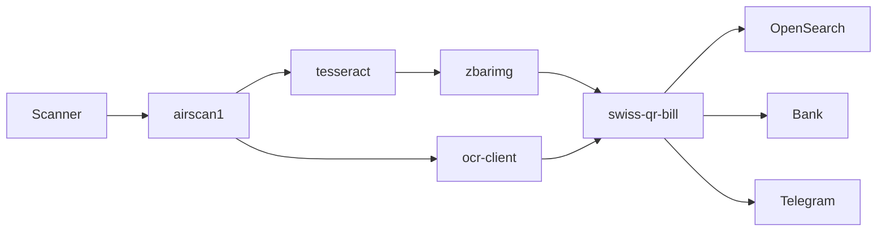

# CLIs Everywhere

XXIV. Go Meetup @ Swisscom #EasterEdition

<br/>

Denys Vitali -- Data, Analytics & AI Engineer @ Swisscom

<br/>

<div class="custom-footer">
  <a href="https://clis-everywhere.k8s.best/">clis-everywhere.k8s.best</a>
</div>

<style>
  div.custom-footer {
    position: absolute;
    bottom: 30px;

    a,a:visited {
      color: #FFF;
    }
  }
</style>


---
layout: image-right
background-size: contain
image: /pictures/denysvitali-gh.png
---
# `whoami`

- Denys Vitali

- ❤️ Open Source, Linux & Reverse Engineering

- ❤️ Creating tools and CLIs

---
layout: image-right-small
background-size: contain
image: /pictures/denysvitali-swisscom-go.png
---
# About Me @ Swisscom

- Data, Analytics & AI Engineer

- Mostly doing DevOps and Software Engineering stuff

- Writing lots of CLIs

- Lots of contributions to Open Source, whenever possible

- Lots of Go


---
layout: cover
background: /pictures/location.jpg
---

# Thank you Swisscom!

📍 Location

---
layout: fact
background: /pictures/cli.png
---

# CLIs Everywhere

---
layout: quote
---

# What is a CLI?

<br/>

> A user interface in which the user interacts with the computer through lines of text instead of graphical images.

\- Wikitionary


---
layout: small-title
---

# Examples of CLIs

```bash
$ id
```

```
uid=1000(dvitali) gid=1000(dvitali) groups=1000(dvitali),970(docker),998(wheel)
```

```bash
$ git add .
$ git commit -m "initial commit"
```

```bash
$ curl -s "https://pizza.k8s.best/api/v1/pizzas" | jq .
```
```json
{
  "pizzas": [
    {
        "name": "Pizza Prosciutto",
        "toppings": ["tomato", "mozzarella", "ham"]
    }
  ]
}
```


---
layout: small-title
---

# Why do we need more CLIs?

- Machine readable / processable outputs

- Command concatenation (piping) `|`

- Scripting (e.g: via `bash`)

- To follow the [Unix Principles](https://en.wikipedia.org/wiki/Unix_philosophy#Eric_Raymond's_17_Unix_Rules)
    - "Write simple programs"
    - "Write small programs"
    - "Value developer time over machine time"
    - "Avoid unnecessary output"

---
layout: fact
background: /pictures/burrito.jpg
---

# `burrito`

---
layout: small-title
---

# Ordering burritos from my SPARC (1992)

Excerpt from the original email

```
Subject: Ordering burritos from my SPARC
From: cjackson@mv.us.adobe.com (Curtis Jackson)
To: tanstaafl@colossus.apple.com
Date: Tue, 08 Sep 92 09:12:20 PDT

There is a little Mexican grocery nearby that has an assembly-line
burrito operation in back. You walk down the line with the person
who is making your burrito, telling them exactly what you want on it.
The problem is that the place is so good and such a good value that
the lines get quite long at times. So La Costena (that's a tilde n)
put in a fax machine and allows you to fax in your orders. Well, we've
gone a quantum leap beyond that with the following.

This is NOT a joke. Ross has taken advantage of the fact that some
PostScript Level 2 printers now have fax capability. Read the whole
doc below when you get a chance -- it represents true burrito decadence!

Curtis
```

[Source](https://web.archive.org/web/20210125000831/http://www.mit.edu/afs.new/sipb/user/marthag/postscript/burritos)


---
layout: small-title
---

# Ordering burritos from my SPARC (1992)

```
Tired of standing in line at La Costena?  This file documents an
automatic facility for sending a fax to La Costena that orders 1 or
more burritos, quesadillas, tacos, and whatever.  The command will
compose the fax, and send it to your favorite PostScript fax printer,
for direct transmission to La Costena, and no paper at this end will
be generated.  Then, when you get there, your food will be waiting.
No worries.

To use this, you will want to add the following lines to your .cshrc
file:

setenv BURRITOPRINTER = <printer>
alias burrito /user/thompson/public/burrito<mach>

<printer> should be the name of a PostScript level 2 printer that
supports fax and is connected to an external phone line. I use

In keeping with long standing Unix tradition, the syntax for
specifying burritos is somewhat obscure. Here is an attempt at
explanation, with some examples at the end.  For a better
understanding, the energetic reader will attempt to thoroughly
comprehend the contents of my .costenarc file.
```

---
layout: small-title
---

# Ordering burritos from my SPARC (1992)

```
burrito [-n "name"] [-t <time>] [-p phone#] [-d] [-x] [FoodSpec [...]]

    -n  specify the name at the top of the order blank.
	   This should be the name of the person who will pick
	   up the order.  Default is current user, as defined in
	   /etc/passwd.
    -t  specify the time at which you will pick up the order.
    	   time may be absolute 24 hour time or +delta. Default is +1:00.
    -p  specify callback number in case La Costena has questions.
	   default is as found in /usr/local/adobe/phones/adobe.phones.
```

---
layout: small-title
---

# Ordering burritos from my SPARC (1992)

```
Up to six FoodSpecs can be specified:
FoodSpec::=<type>[options*][/<name>]
<type> ::= [b|t|m|q|T]
    (burrito, taco, mexico city, quesadilla, Taqitaco)
options:
    +g  gucamole
    +c  cheddar
    +cc cotija
    +cl cilantro
    +cm monterey
    +i"note" special instructions (e.g. black beans, no rice, etc.)
	NOTE: the "s need to be escaped if the shell sees them:
	   +i\"note\"
    +j  whole jalepenos
    +jf fresh jalapenos
    +js sliced jalapenos
    +n:i i copies of this food item. (default = 1)
    +o  olives
    +s  medium salsa
    +sc sour cream
    +sf fire salsa
    +sh hot salsa
```

---
layout: small-title
---

# Ordering burritos from my SPARC (1992)
```
burrito -time +:30 b+g+cc+jf+jf+sf+sc-sc+i"Black Beans"+n:2/Ross \
   b+v:cc+g+cm+sc+i"no rice"/Kathie

interpretation:
logged in user will pick up an order in 30 minutes.
  Ross wants two rice and bean (default) burritos with
    guacamole
    cotija
    fresh jalepenos (double)
    fire salsa
    no sour cream (cancelled)
    Black beans (comment)
  Kathie wants a Chile Colorado burrito with
    guacamole
    montery cheese
    sour cream
    no rice (comment)

```


---
layout: default
---

# Result


- The burrito order only needs textual input

- The process can be extended

- You can now order burritos automatically, thanks to `cron`

<br/>  

```
# Order a Burrito on Monday at 11:45 AM
45 11 * * 1 burrito -time +:30 b+g+cc+jf+jf+sf+sc-sc+n:2/Denys
```

---
layout: cover
background: /pictures/bg-1.jpg
---

# ODI

Overengineered Document Indexing*


<p class="small">* personal project, not related to Swisscom</p>

<style>
p.small {
  font-size: 0.6em;
}
</style>


---
layout: image-right
background-size: contain
image: /pictures/paper-stack.jpg
---

## A more realistic example

Let's assume for a second that you're like me:

- You receive lots of mail (postal mail, yes.)

- You mostly care about invoices

- You like to build CLIs

- You have a scanner at home


---
layout: default
---

## Let's build a solution




---
layout: image-right
background-size: contain
image: /pictures/scanner.jpg
---

# Scanning the documents

Let's see how we can scan our documents:

<ul>
<li v-click>
<a href="https://github.com/stapelberg/airscan"><code>stapelberg/airscan</code></a>
</li>

<li v-click>
<code>airscan1 -host=scanner-1 -source=adf</code> *
</li>

<li v-click>
<pre>
./page1.jpg
./page2.jpg
./page3.jpg
</pre>
</li>
</ul>

<small v-click>* ADF = Automatic Document Feeder</small>

---
layout: image-right
background-size: contain
image: /pictures/invoice-example.jpg
---

# Result

- A set of JPG images
  - Some might be blank [1]
  - Some contain a QR code (QR-Bill) [2]
  - Most of them contain text [3]


---
layout: cover
background: /pictures/bg-1.jpg
---

# Some might be blank...


---
layout: image-right
background-size: contain
image: /pictures/blankpage-detector.jpg
---

# blank-page-detector

```
$ blank-page-detector images/page*.jpg
images/page1.jpg
images/page4.jpg

$ rm $(blank-page-detector images/page*.jpg)
```

[github.com/DMSrs/blankpage-detector](https://github.com/DMSrs/blankpage-detector)

---
layout: cover
background: /pictures/swiss-qr-bill.jpg
---

# Some contain a QR code...

---
layout: image-right
background-size: contain
image: /pictures/zbar-webpage.jpg
---

# zbarimg

zbarimg - scan and decode bar codes from image file(s)

```
$ zbarimg -q page1.jpg
QR-Code:SPC
0200
1
CH3489144137632279546
S
Denys Vitali
Example
1
8600
Zurich
CH

10.81
CHF

NON
Please Don't Send Money to a random IBAN
EPD
```

---
layout: small-title
---

# Write a parser

<div class="side-by-side">
  
  
</div>

<div style="text-align:center; margin-left: auto;">
  <a href="https://github.com/denysvitali/go-swiss-qr-bill">github.com/denysvitali/go-swiss-qr-bill</a>
</div>

<style>
div.side-by-side {
  display: flex;
  width: 50vw;
  flex-direction: row;
  margin-bottom: 1em;
  
  img {
    max-height: 350px;
    width: 100%;
    object-fit: contain;
  }
}
</style>

---
layout: small-title
---

# Use the CLI you've just created

```
$ swiss-qr-bill < qrbill.txt
```

```json{monaco}
{
  "Header": {
    "QRType": "SPC",
    "Version": {
      "Major": 2,
      "Minor": 0
    },
    "CodingType": 1
  },
  "CreditorInformation": {
    "IBAN": "CH3489144137632279546"
  },
  "Creditor": {
    "Name": "Denys Vitali",
    "StrtNmOrAdrLine1": "Example",
    "BldgNbOrAdrLine2": "1",
    "PostalCode": "8600",
    "Town": "Zurich",
    "CountryCode": "CH"
    // ...
   }
}
```

---
layout: small-title
---

# Pipe it to `jq`

Perform whatever check you need via `jq`, for example:

- discard bills that don't have your name on it
- don't automatically pay stuff over 500 CHF
- ...

<br/>

```
$ swiss-qr-bill | jq .PaymentAmount.Amount.Base
10
```

---
layout: cover
background: /pictures/staple.jpg
---

# Some contain a staple...

<div v-click>
Sorry, I can't build a CLI for that. <br/>
Just remember to remove them before scanning your documents.
</div>

---
layout: cover
background: /pictures/invoice-1.jpg
---

# Some contain text...

---
layout: image-right
background-size: contain
image: /pictures/ocr-scan.jpg
---

# tesseract

```
$ tesseract -l eng+deu page1.jpg /tmp/result
```
<br/>

<pre style="font-size: 10px; padding: 4px;">
WIKIPEDIA

The Free Encyclopedia

Optical character recognition

A process called Optical Character Recognition
(OCR) converts printed texts into digital image files. It
is a digital copier that uses automation to convert
scanned documents into editable, shareable PDFs that
are machine-readable. OCR may be seen in action
when you use your computer to scan a receipt. The
scan is then saved as a picture on your computer. The
words in the image cannot be searched, edited, or Farly —ÜZZÄI““""_“ e i

counted, but you may use OCR to convert the image A e T 0230
to a text document with the content stored as text.
OCR software can extract data from scanned
documents, camera photos, and image-only PDFs. It
makes static material editable and does away with the

necessity for human data entry.[!]

Video of the process of scanning and real-
time optical character recognition (OCR)
with a portable scanner
</pre>

---
layout: image-right
background-size: contain
image: /pictures/image-stcks-and-iphone-racks.jpg
---

# Improving OCR quality

Inspiration: [Image Stacks and iPhone Racks - Building an Internet Scale Meme Search Engine (2023)](https://findthatmeme.com/blog/2023/01/08/image-stacks-and-iphone-racks-building-an-internet-scale-meme-search-engine-Qzrz7V6T.html)


<div v-click>
TL;DR:

</div>

---
layout: small-title
---

# First OCR attempt


<div v-click style="margin-top: 2em">
... ended up not using it at all.
</div>

<div v-click style="margin-top: 2em">
(does anyone need an iPhone 8?)
</div>


---
layout: small-title
---

# Second OCR attempt

<div class="ocr-server-images">
  
  
  
</div>

<style>
div.ocr-server-images {
  display: flex;
  column-gap: 10px;
}

div.ocr-server-images img {
  height: 400px;
  max-width: 400px;
  object-fit: contain;
}
</style>

---
layout: small-title
---

# Advantages

- Fully on-device (on-device processing)
- Free
- I can now re-use this for other things


<h4 style="margin-top: 1em; margin-bottom: 1em;">Comparison w/ Azure:</h4>


<style>
div.side-by-side {
  display: flex;

}
</style>


---
layout: small-title
---

# OCR Server (Kotlin on Android)

```kotlin
routing {
    get("/healthz", healthz())
    post("/api/v1/ocr", handleOcr())
    get("/api/v1/battery", handleBattery())
}
```

`POST /api/v1/ocr`

<div class="monaco">

```json {monaco}
{
  "textBlocks": [
    {
      "text": "The Free Encyclopedia",
      "lines": [
        {
          "text": "The Free Encyclopedia",
          "angle": 0,
          "confidence": 0.8299753,
          "recognizedLanguage": "en"
        }
      ],
      "boundingBox": {
        "top": 80,
        "bottom": 92,
        "left": 86,
        "right": 203
      },
      "lang": "und"
    }
  ],
  "barcodes": [
    {
      "boundingBox": {
        "top": 2471,
        "bottom": 3007,
        "left": 781,
        "right": 1316
      },
      "displayValue": "SPC\r\n0200\r\n1\r\nCH6431961000004421557\r\nS\r\nMax Muster & Söhne\r\nMusterstrasse\r\n123\r\n8000\r\nSeldwyla\r\nCH\r\n\r\n\r\n\r\n\r\n\r\n\r\n\r\n50.00\r\nCHF\r\nS\r\nSimon Muster\r\nMusterstrasse\r\n1\r\n8000\r\nSeldwyla\r\nCH\r\nQRR\r\n000008207791225857421286694\r\nPayment of travel\r\nEPD\r\n",
      "rawValue": "SPC\r\n0200\r\n1\r\nCH6431961000004421557\r\nS\r\nMax Muster & Söhne\r\nMusterstrasse\r\n123\r\n8000\r\nSeldwyla\r\nCH\r\n\r\n\r\n\r\n\r\n\r\n\r\n\r\n50.00\r\nCHF\r\nS\r\nSimon Muster\r\nMusterstrasse\r\n1\r\n8000\r\nSeldwyla\r\nCH\r\nQRR\r\n000008207791225857421286694\r\nPayment of travel\r\nEPD\r\n"
    }
  ]
}
```

</div>

<style>
  div.monaco iframe {
   	height: 250px !important; 
    background-color: red;
  }
</style>

---
layout: small-title
---

# `ocr-client`

```
$ ocr-client -h 
Usage: ocr-client [--debug] --ocr-api OCR-API [--ocr-api-ca-path OCR-API-CA-PATH] [--output-mode OUTPUT-MODE] INPUTPATH

Positional arguments:
  INPUTPATH

Options:
  --debug, -D
  --ocr-api OCR-API, -a OCR-API
                         Address of the OCR API [env: OCR_API_ADDR]
  --ocr-api-ca-path OCR-API-CA-PATH, -c OCR-API-CA-PATH [env: OCR_API_CA_PATH]
  --output-mode OUTPUT-MODE, -o OUTPUT-MODE [default: text]
  --help, -h             display this help and exit
```

<br/>

```bash
export OCR_API_ADDR=https://ocr-api.lan:8443/
export OCR_API_CA_PATH=$HOME/pki/root/certs/root.crt
ocr-client -o json ~/Pictures/invoice-1.jpg
```

---
layout: small-title
---

# Current CLIs diagram




---
layout: image-right
image: /pictures/opensearch-cli.png
backgroundSize: contain
---

# Indexing to OpenSearch

- Quite easy
- If you're lazy you can always ask ChatGPT
---
layout: small-title
---

# Re-using components

```
$ documents-indexer -h
Usage: documents-indexer --ocr-api OCR-API [--ocr-api-ca-path OCR-API-CA-PATH] --os-address OS-ADDRESS --os-username OS-USERNAME --os-password OS-PASSWORD [--insecure] [--debug] [--workers WORKERS] INPUTDIR

Positional arguments:
  INPUTDIR

Options:
  --ocr-api OCR-API, -o OCR-API
                         Address of the OCR API [env: OCR_API_ADDR]
  --ocr-api-ca-path OCR-API-CA-PATH [env: OCR_API_CA_PATH]
  --os-address OS-ADDRESS, -a OS-ADDRESS [env: OPENSEARCH_ADDR]
  --os-username OS-USERNAME, -u OS-USERNAME [env: OPENSEARCH_USERNAME]
  --os-password OS-PASSWORD, -p OS-PASSWORD [env: OPENSEARCH_PASSWORD]
  --insecure [env: OPENSEARCH_INSECURE_SKIP_VERIFY]
  --debug, -D [env: OCR_CLIENT_DEBUG]
  --workers WORKERS, -w WORKERS [default: 4]
  --help, -h             display this help and exit
```
<br/>
<div v-click>

- Basically a CLI re-using `swiss-qr-bill`, `ocr_client` and `opensearchapi`
- You can do the same in Bash

</div>

---
layout: cover
---

# UI

---
layout: small-title
---

# `odi/backend`

- Connects to OpenSearch (`/search`)
- Retrieves the document image (`/documents/:id`)

```go
func (s *Server) initRoutes() {
	s.e.Use(gin.Logger())
	s.e.Use(cors.Default())

	g := s.e.Group("/api/v1")
	g.POST("/search", s.handleSearch)
	g.GET("/documents/:id", s.handleGetDocument)
}
```

---
layout: small-title
---

# `odi/frontend`


---
layout: small-title
---

# OpenSearch content


---
layout: cover
background: /pictures/bg-2.jpg
---

# CLIs takeways

---
layout: small-title
---

# CLIs takeways

<ol>
<li v-click>Create lots of CLIs</li>
<li v-click>Make them small
  <ul>
    <li>One CLI = One building block</li>
    <li>Up to you to define what is "small" in your context</li>
  </ul>
</li>
<li v-click>Make them publicly available</li>
<li v-click>Write them in Go
<ul v-click>
  <li>Anyone can re-use your package</li>
  <li>Anyone can search / use your types (pkg.go.dev), especially structs with JSON mappings</li>
  <li>No need to re-invent the wheel</li>
</ul>
</li>
<li v-click>Provide machine-readable output, as well as textual output
  <ul>
    <li>Facilitates automation (for machines)</li>
    <li>Helps with the User Experience (for humans)</li>
  </ul>
</li>
</ol>

---
layout: cover
background: /pictures/bg-3.jpg
---

# Building a CLI

---
layout: small-title
---

# My Approach

Usual boilerplate:

```go{monaco}
package main

import (
  "github.com/alexflint/go-arg"
  "github.com/sirupsen/logrus"
)

var args struct {
  Debug *bool `arg:"-D,--debug"`
  SomeFile string `arg:"positional,required"`
}

var logger = logrus.New()

func main(){
  arg.MustParse(&args)
  if args.Debug != nil && *args.Debug {
    logger.SetLevel(logrus.DebugLevel)
  }
  // Do something
}
```

---
layout: small-title
---

# Output - JSON

```go
func main(){
  // ...
  if args.Output == "json" {
    enc := json.NewEncoder(os.Stdout)
    err = enc.Encode(result)
    if err != nil {
      logger.Fatalf("unable to encode to JSON: %v", err)
    }
    return
  }
  // Pretty Format
  // ...
}
```

---
layout: small-title
---

# Output - Table

For example:

```
$ docker ps
CONTAINER ID   IMAGE      COMMAND                  CREATED          STATUS          PORTS                                                                     NAMES
0646c62f4845   node:lts   "docker-entrypoint.s…"   59 minutes ago   Up 59 minutes   127.0.0.1:3000->5173/tcp

$ kubectl get nodes
NAME           STATUS   ROLES                  AGE    VERSION
n-1            Ready    control-plane,master   10m    v1.27.0
n-2            Ready    <none>                 10m    v1.27.0
n-3            Ready    <none>                 10m    v1.27.0
```

<div v-click style="margin-top: 2em">
-> <a href="https://github.com/alexeyco/simpletable">alexeyco/simpletable</a>
</div>


---
layout: two-cols
---

# Output - Table - Example

```go
t := simpletable.New()
t.SetStyle(simpletable.StyleCompactClassic)
t.Header = &simpletable.Header{
  Cells: []*simpletable.Cell{
    {Text: "NAME"},
    {Text: "STATUS"},
  }
}

values := [][]string{
  {"A", "ONLINE"},
  {"B", "OFFLINE"},
}

for _, v := range values {
  t.Body.Cells = append(
    t.Body.Cells, 
    []*simpletable.Cell{
      {Text: v[0]},
      {Text: v[1]},
    }
  )
}
```

::right::

<div class="align">

```
 NAME   STATUS  
 A      ONLINE  
 B      OFFLINE 
```

</div>

<style>
div.align {
  margin-top: 3.2em; 
}
</style>

---
layout: cover
background: /pictures/charm.jpg
backgroundSize: contain
dim: false
---

---
layout: cover
background: /pictures/charm-libs.jpg
backgroundSize: contain
dim: false
---

---
layout: cover
background: /pictures/lip-gloss.png
backgroundSize: contain
dim: false
---


---
layout: cover
background: https://media4.giphy.com/media/SXS950PdvjSfu9bCpV/giphy.gif?cid=ecf05e471g13n4a6cbb8qr0l50zmr2usi9czi22aexc27w30&rid=giphy.gif&ct=g
---

# Q&A

---
layout: default
---

# Thank you!

<div class="social-info">

<div class="links">
  <h3>Denys Vitali</h3>
  <div class="icon-values">
    <div class="row">
      <mdi-github class="icon"/>
      <a href="https://github.com/denysvitali">@DenysVitali</a>
    </div>
    <div class="row">
      <mdi-twitter class="icon"/>
      <a href="https://twitter.com/DenysVitali">@DenysVitali</a>
    </div>
    <div class="row">
      <mdi-linkedin class="icon"/>
      <a href="https://www.linkedin.com/in/denysvitali/">/in/denysvitali</a>
    </div>
    <div class="row">
      <mdi-telegram class="icon"/>
      <a href="https://t.me/denvit">@denvit</a>
    </div>
    <div class="row">
      <mdi-web class="icon"/>
      <a href="https://denv.it">https://denv.it</a>
    </div>
    <div class="row">
      <mdi-email class="icon"/>
      denys@denv.it
    </div>
  </div>
</div>
</div>

<style>
  div.social-info {
    display: flex;
    margin-top: 2em;
    flex-direction: row;
    justify-content: space-around;
    column-gap: 2rem;
  }

  div.social-info a {
    color: #FFF;
  }

  div.icon-values {
    display: flex;
    flex-direction: column;
    row-gap: 10px;

    div.row {
      display: flex;
      column-gap: 10px;
    }
  }

  span.icon-text {
    line-height: 20px;
  }

  img.profile-picture {
    border-radius: 150px; 
    height: 150px;
  }
</style>
